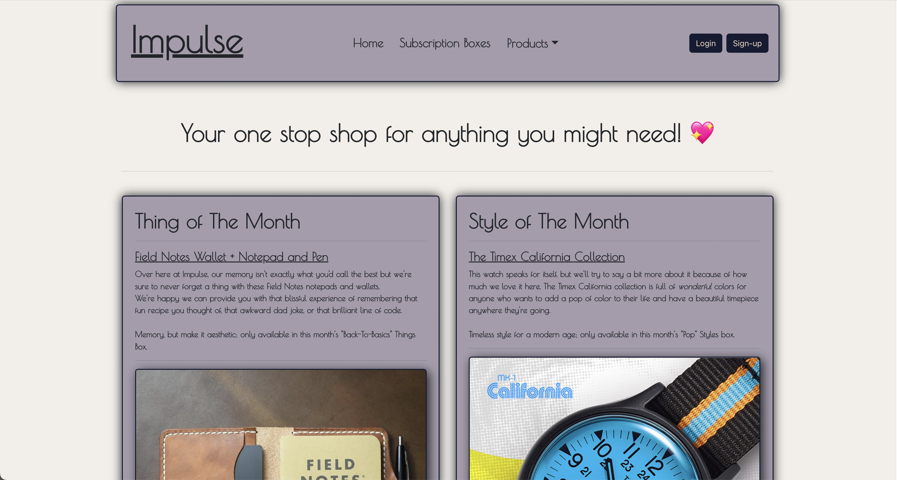

## Impulse

- The one stop shop for subscription boxes with impulse buys catered directly to you!

## Intended Market

- Anyone who is curious about trying new things or anyone who is delighted by the novelty of things and stuff.
- For people who like the novelty of receiving a box of products catered directly to them.

## Functionality

Users:

- Users will create an account to log in and be able to log out as well.
- Users will choose between a "Things" bow or a "Clothing" box, and a certain number of items will be in the box.

Inventory:

- Inventory will update with current items and things available for boxes
- Inventory will sort itself into tags based on what the user picks for their box

Clothes and Accessories Rental:

- A similar subscription box but the items in it will need to be returned.
- Clothes and Accessories can be picked for certain occasions based on website tags
- Boxes can be recycled and returned for a discount on the next months box.
- If the rental isn't returned in the alloted time frame, the items price will be charged to the user.

Social Media Forums:

- Users can post photos of their boxes and stylings to the forums
- Users can submit possible items for inventory and be voted on.
- Users can leave reviews of boxes they have received and people can comment on them.

## Design

- [API design](docs/apis.md)
- [Data model](docs/data-model.md)
- [GHI](docs/ghi.md)
- [Integrations](docs/integrations.md)

## Want to test Impulse on your own machine? Want to make your own storefront based on Impulse? Follow these steps!

For Mac users:

- Fork, Clone, and Star the repository from [MEAN Coders](https://gitlab.com/mean-coders/module-three-project)
- In terminal, run bash hard-reset.sh
  For soft resets:
- run bash soft-reset.sh

(dev note: hard-reset.sh MUST be run on first start or no databases will exist)

For Windows users:

- Fork, Clone, and Star the repository from [MEAN Coders](https://gitlab.com/mean-coders/module-three-project)
- On first start, in powershell, run:
  _ docker volume create postgres-data
  _ docker volume create pgadmin \* docker-compose up --build
  For soft resets, in powershell:
- docker-compose down
- docker-compose up --build

(dev note: the hard-reset.sh and soft-reset.sh files can be ran on Windows with a git bash terminal or WSL)

Congratulations, you've now installed Impulse on your local machine!

Once the containers are running:

- Enter the Docker CLI for products
- Enter: `python manage.py loaddata inventory.json`
- Things and Styles pages should now be populated with product cards!

- Subscription boxes are created in house and based on a monthly item selection from the product pool, so those are the only things you can buy.
- Add one to your cart and do the checkout form. This should take you to an adorable receipt page!

Unit Tests exist for Impulse and can be enabled by following these steps:

- navigate to the pgadmin container here: [PgAdmin](http://localhost:8060)
- Login with the supplied username and password on the docker-compose.yaml file under the 'pgadmin' service.
- Once logged in, register the server by right clicking server then Register > Server.
- In the window pop-up, provide a name for the database
- Navigate to the connections tab on top of the pop-up window, Host name/address will be 'postgres'
- Username will be postgres (as we need to be able to provide admin permission)
- Password is supplied in the docker-compose.yaml under the 'postgres' service
- Save the password for ease of access and save the form, the pop-up should disappear.
- Once the server is registered, click the dropdown on servers, then the dropdown for Login/Group Roles
- Right-click products, click properties in the pop-up, navigate to 'Privileges' in the pop-up
- Make sure create databases is toggled on and save.
- Repeat the same steps for subscriptions
- This allows for test-databases to be created in the project

To run tests:

Set up pgadmin:

- go to localhost:8060/login in the browser. Log in with any email and password.
- Click on Add New Server; name it `postgres-data`
- Click on Connection tab. For Host name and Username: `postgres`; password: `test-databases`. Save.
- On the right side, click Servers >> Login/Group Roles
  - Right-click on products >> Properties. Click on Privileges. On Create databases? slide the slider right.
  - Right-click on subscriptions >> Properties. Click on Privileges. On Create databases? slide the slider right.

Then:

- Enter the Docker CLI or use the bash command to enter the container from terminal
- Enter: `python manage.py test`
- This should run the tests for the individual service, repeat the steps in the other service to test that one.
